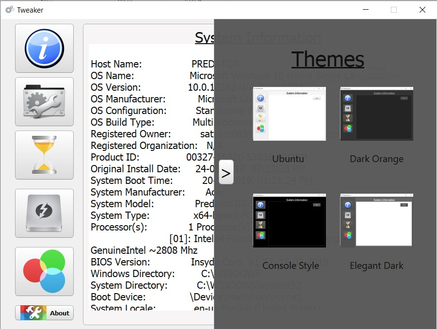

# Windows-Tweaker

This is a small tool that does few registry and CMD tricks with a nice and user-friendly interface

**The Tabs:**

*Note: The software should be run as administrator for accessing all features and making them effective.*

>**System Information**

With this tab you are just one tap away from getting all the information about your system, including Boot time,processor,WiFi card,etc

>**Hide/Unhide Drive**

With this particular tab u can easily hide and unhide files and folders without the worry of exposing them under hidden file/folder category when you turn that feature on.

**1)** Simply select whether you want to hide/Unhide the file/folder from the "option" option.

**2)** Next browse for your file/folder to hide or choose from the "Hidden file/folder" list to unhide.

**3)** Finally click the Hide/Unhide button.

>**Timer**

This has two features:

1) Boot Timer

2) Seconds in system clock

>>*Boot Timer*

This can be helpful for you who want ot shutdown/restart their PC after a certain time

**1)** Simply select whether you want to shutdown/restart the PC after a certain amount of time.

**2)** Enter time in seconds in the given textbox.

**3)** Finally press "set timer" button

>>*Seconds in system clock*

This can be used to show or hide seconds in the system clock.

*Note: To view changes to this feature you would have to restart the explorer/Windows*

>**Local Drive Change**

This tab has some minimalistic features as well as a local drive icon changer.

This has three features:

1) Drive icon changer

2) Drive letter position change

3) Show/Hide drive

>>*Drive icon changer*

This can be used to change icons of individual local drives

**1)** Simply select the drive letter from the drop-down menu.

**2)** Next browse for the icon(.ico,.exe,.dll) file in the system and it will appear on the screen.

**3)** Finally press the "set icon" button.

>>*Drive letter position change*

This can be simmply used to change the way drive letters are displayed on the My PC's Local drives text e.g. as prefix,as suffix,hide

>>*Drive letter position change*

This can be used to merely hide/show icon in the My PC.

**Other features include change of theme and an about pop-up.**

